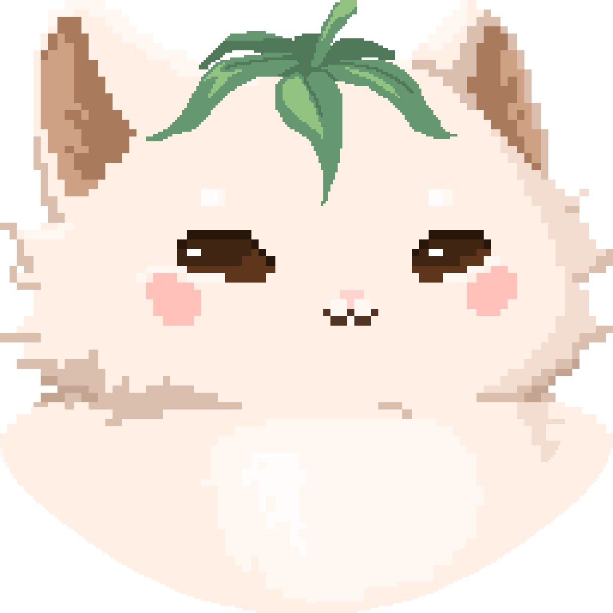
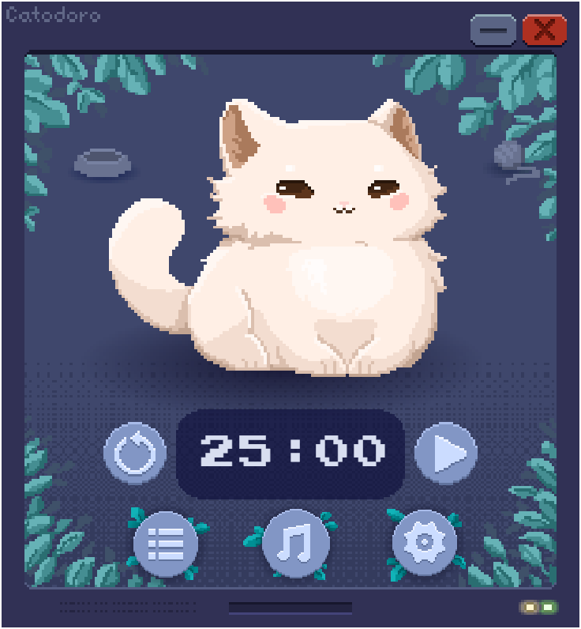
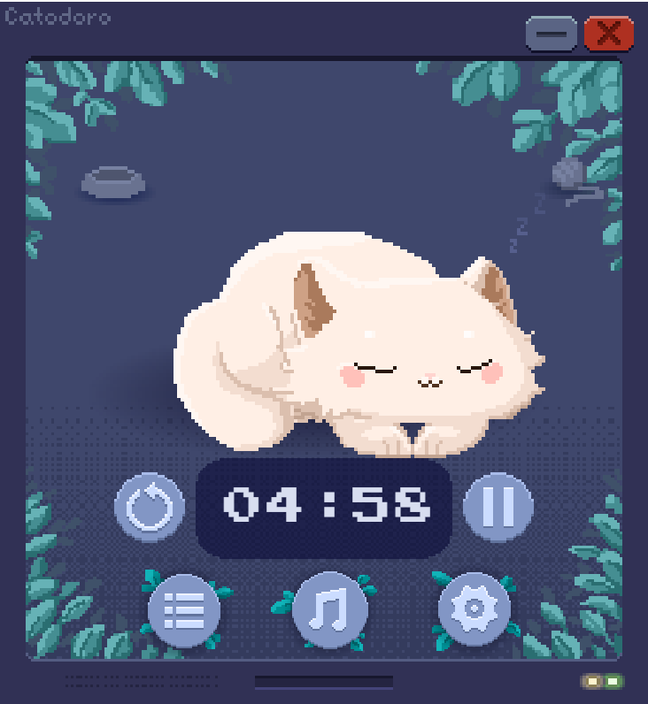
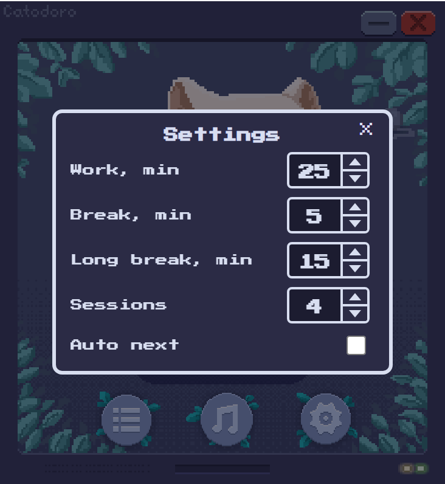
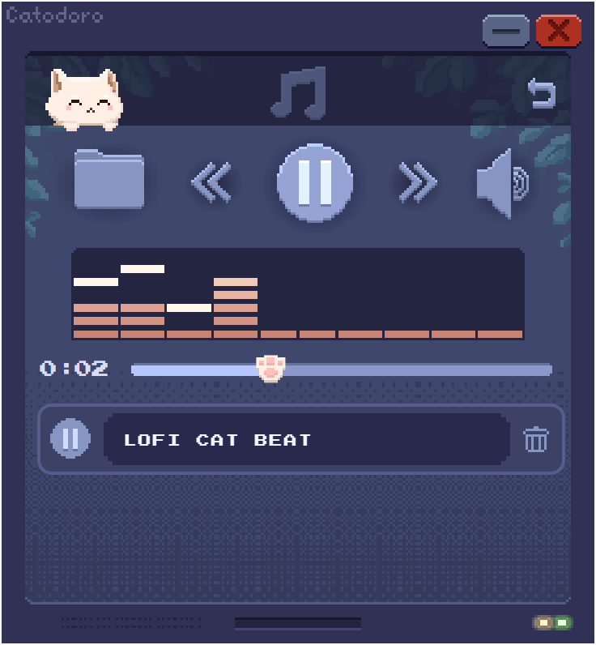
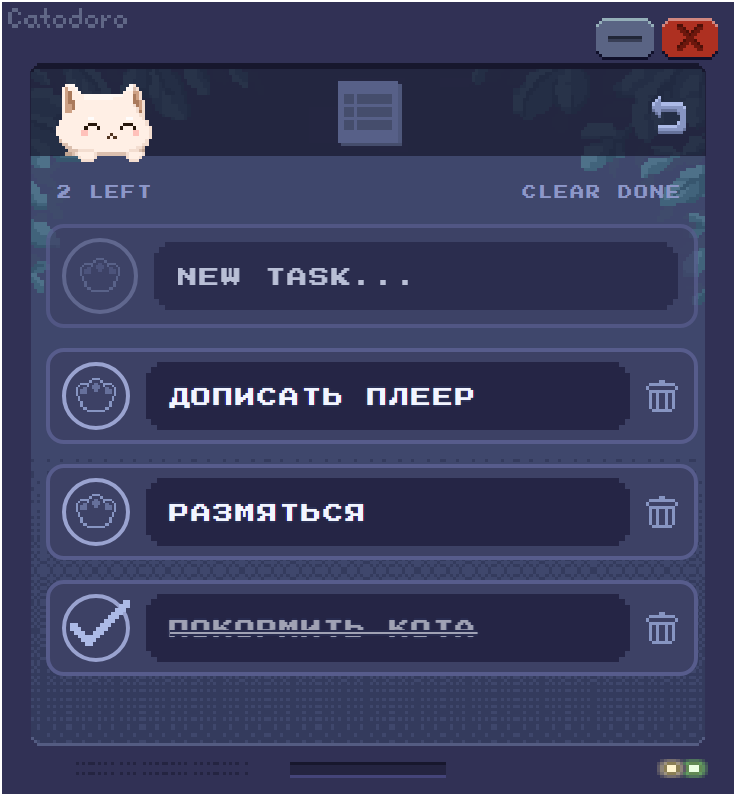
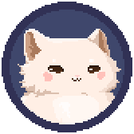
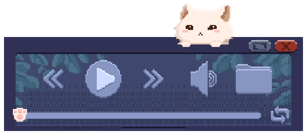

<p align="center">
  
</p>

# 🐱 Catodoro

Уютный десктопный Pomodoro-таймер с пиксельным котом-компаньоном. Кот работает вместе с тобой, дремлет на перерыве, ест из миски и играет с мячиком. Всё нарисовано в pixel art и оживает через спрайт-листы из Aseprite, без единого GIF.

> Личный проект в две руки. Код: Анна ([@AnnaDaniuk777](https://github.com/AnnaDaniuk777)). Дизайн, пиксель-арт и анимации кота: [@lobotomy-online](https://github.com/lobotomy-online).

**Язык / Language:** &nbsp; [🇷🇺 Русский](#-русский) &nbsp;|&nbsp; [🇬🇧 English](#-english)

---

<a name="-русский"></a>
<details open>
<summary><h2>🇷🇺 Русский</h2></summary>

### О проекте

Catodoro помогает держать фокус по методике Pomodoro: чередует рабочие интервалы и перерывы, а компанию тебе составляет пиксельный кот, который реагирует на то, что происходит на таймере. Проект пока в развитии, но основные экраны и механики уже работают.

### Экраны и окна

#### 🏠 Главный экран



Кот, крупный таймер и управление. Клик по коту запускает таймер и ставит его на паузу, кнопка сброса возвращает интервал в начало. Рядом иконки «покормить» и «поиграть» для перерыва. Внизу навигация: задачи, музыка, настройки. Сверху кнопки свернуть и закрыть.

#### 😴 Перерыв



Когда начинается перерыв, кот укладывается и засыпает. Можно кликнуть по миске или по клубку, тогда он поест или поиграет.

#### ⚙️ Настройки



Длительности работы, короткого и длинного перерыва, число сессий до длинного перерыва, авто-цикл, звук и громкость, уведомления, режим «поверх всех окон», повтор плейлиста и переключение языка (русский и английский).

#### 🎵 Музыкальный плеер



Свой плейлист: добавление треков, play и pause, эквалайзер по звуку трека и таймлайн с лапкой. Пути треков запоминаются между запусками.

Управление воспроизведением:

- **Перемотка.** Зажми «назад» или «вперёд», и трек будет отматываться, пока держишь кнопку.
- **Кнопка «назад».** Короткое нажатие возвращает трек в начало, второе подряд переключает на предыдущий.
- **Позиция в треке.** Тащи лапку по полоске или кликни в нужное место.
- **Громкость.** Колёсико мыши над иконкой динамика, либо клик по ней и перетаскивание кружка. Клик мимо закрывает регулятор.

#### ✅ Список задач



Простые дела: добавление, инлайн-редактирование, отметка галочкой-лапкой, счётчик и очистка выполненного.

#### 🐾 Плавающий виджет таймера



Когда основное окно свёрнуто, на экране остаётся маленькое окошко с котом и таймером. Его можно перетаскивать, а клик запускает и ставит таймер на паузу.

#### 🎧 Мини-плеер



Отдельное компактное окно, чтобы управлять музыкой не разворачивая приложение: предыдущий, play, следующий, громкость и перемотка. Кот сидит на панели и переезжает к регулятору громкости.

Ещё есть иконка в системном трее (клик запускает и ставит на паузу, двойной клик открывает окно) и уведомления от имени Catodoro в конце каждого интервала.

### Возможности кратко

- Таймер Pomodoro с работой, короткими и длинными перерывами, авто-циклом и сохранением прогресса.
- Живой кот со своей мини стейт-машиной анимаций: работает, отдыхает, спит, ест, играет.
- Музыкальный плеер с плейлистом, перемоткой и повтором.
- Список задач.
- Плавающий виджет таймера и мини-плеер при свёрнутом окне.
- Трей и уведомления.
- Интерфейс на русском и английском.

</details>

<a name="-english"></a>
<details>
<summary><h2>🇬🇧 English</h2></summary>

### About

Catodoro helps you stay focused with the Pomodoro method: it alternates work intervals and breaks, and a pixel cat keeps you company, reacting to what the timer is doing. The project is still growing, but the core screens and mechanics already work.

### Screens and windows

#### 🏠 Main screen


The cat, a large timer and the controls. Clicking the cat starts the timer and pauses it, the reset button sends the interval back to the start. Next to it are the feed and play icons for breaks. The bottom bar navigates to tasks, music and settings. The top has minimize and close.

#### 😴 Break


When a break starts, the cat lies down and falls asleep. Click the bowl or the yarn ball and it will eat or play.

#### ⚙️ Settings


Work, short break and long break durations, the number of sessions before a long break, auto cycle, sound and volume, notifications, an always on top mode, playlist repeat and language switching (Russian and English).

#### 🎵 Music player


Your own playlist: add tracks, play and pause, an equalizer driven by the track itself and a timeline with a paw. Track paths are remembered between launches.

Playback controls:

- **Scrubbing.** Hold previous or next and the track rewinds while you keep the button down.
- **Previous button.** A short press restarts the track, a second press switches to the previous one.
- **Position.** Drag the paw along the bar or click anywhere on it.
- **Volume.** Scroll over the speaker icon, or click it and drag the knob. Clicking outside closes the slider.

#### ✅ Task list


Simple to do items: add, edit inline, tick with a paw checkbox, a counter and a clear done action.

#### 🐾 Floating timer widget


When the main window is minimized, a small window with the cat and timer stays on screen. You can drag it, and a click starts and pauses the timer.

#### 🎧 Mini player


A separate compact window to control music without restoring the app: previous, play, next, volume and scrub. The cat sits on the panel and slides over to the volume control.

There is also a system tray icon (click starts and pauses, double click opens the window) and notifications from Catodoro at the end of each interval.

### Features at a glance

- Pomodoro timer with work, short and long breaks, auto cycle and saved progress.
- A living cat with its own mini animation state machine: works, rests, sleeps, eats, plays.
- Music player with a playlist, scrubbing and repeat.
- Task list.
- Floating timer widget and mini player when the window is minimized.
- Tray and notifications.
- Russian and English interface.

</details>

---

## 📦 Установка / Install

Готовые сборки лежат в [релизах](https://github.com/AnnaDaniuk777/pomodoro-cat/releases). / Ready builds live in [releases](https://github.com/AnnaDaniuk777/pomodoro-cat/releases).

**Windows:** скачай `Catodoro-<версия>-windows-x64.exe` и запусти установщик, либо возьми `windows-portable.exe` и запусти без установки. / Download the installer, or grab the portable build and run it without installing.

**macOS:** скачай `Catodoro-<версия>-mac-arm64.dmg` для Apple Silicon или `mac-x64.dmg` для Intel. Приложение не подписано, поэтому при первом запуске нажми на нём правой кнопкой и выбери «Открыть». / The app is not signed, so on the first launch right click it and choose Open.

## 🚀 Запуск / Run

Нужен свежий Node.js (20 или новее) / Requires a recent Node.js (20 or newer).

```bash
npm install
npm run dev
```

| Скрипт / Script | Что делает / What it does |
|---|---|
| `npm run dev` | Vite dev-сервер плюс окно Electron. / Vite dev server plus the Electron window. |
| `npm run dev:web` | Только Vite в браузере, без Electron. / Vite in the browser only, no Electron. |
| `npm run build` | Проверка типов и продакшен-сборка. / Type check and production build. |
| `npm run lint` | ESLint. |

## 👭 Авторы / Authors

<table>
  <tr>
    <td align="center">
      <a href="https://github.com/AnnaDaniuk777">
        <br>
        <b>Анна</b>
      </a><br>
      код и разработка<br>
      <sub>code and development</sub>
    </td>
    <td align="center">
      <a href="https://github.com/lobotomy-online">
        <br>
        <b>lobotomy-online</b>
      </a><br>
      дизайн, пиксель-арт, анимации кота<br>
      <sub>design, pixel art, cat animations</sub>
    </td>
  </tr>
</table>

## 🪪 Лицензия / License

GNU GPL 3.0, см. / see [`LICENSE`](LICENSE). Копилефт выбран из-за шрифта Arcade Jeu (тоже под GPL 3.0). / Copyleft is chosen because of the Arcade Jeu font (also under GPL 3.0).

Шрифты / Fonts: Arcade Jeu (GPL 3.0), Press Start 2P (OFL). Спрайты кота и UI-элементы созданы авторами проекта. / Cat sprites and UI elements are created by the project authors.
